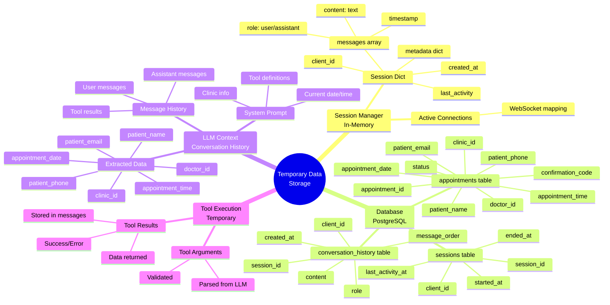
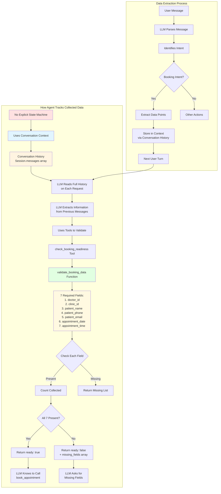
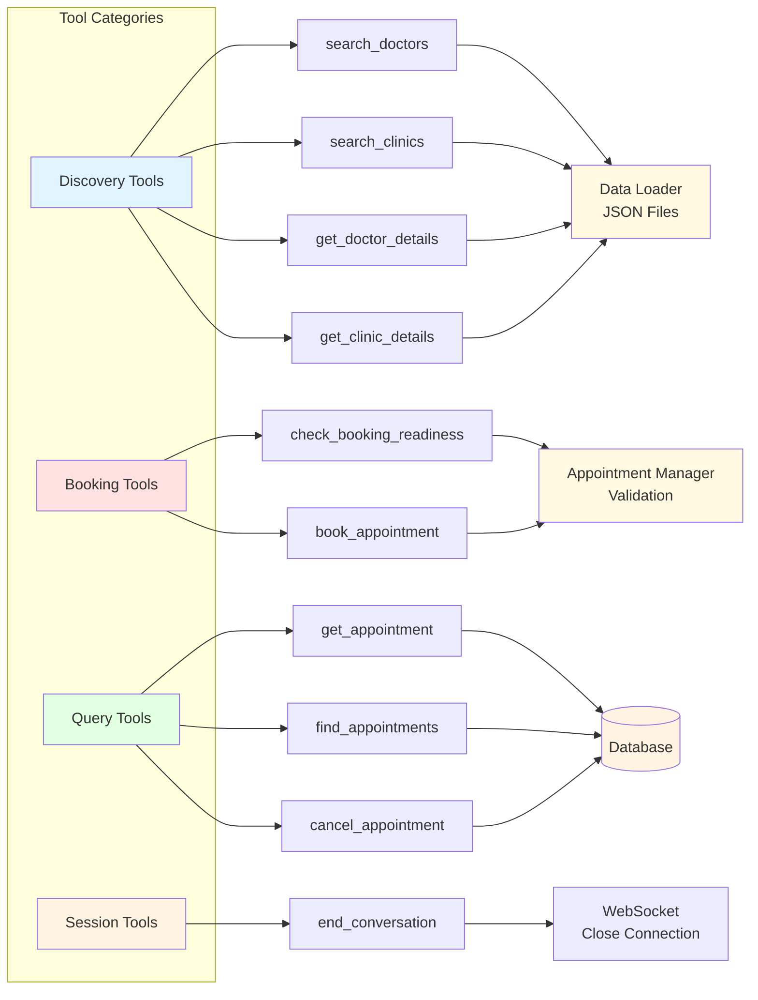
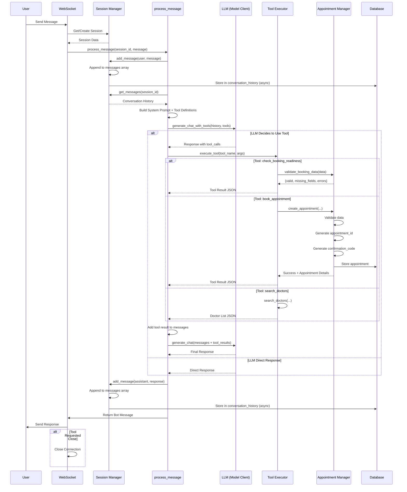

# Appointment Scheduling Agent - Complete Flow Analysis

## System Architecture Flowchart

```mermaid
flowchart TD
    Start([User Sends Message]) --> WS[WebSocket Endpoint]
    WS --> SM[Session Manager]
    SM --> |Get/Create Session| Session{Session Exists?}
    Session -->|No| CreateSession[Create New Session]
    Session -->|Yes| GetSession[Get Existing Session]
    CreateSession --> AddUserMsg[Add User Message to Session]
    GetSession --> AddUserMsg
    
    AddUserMsg --> StoreDB[(Store in DB<br/>conversation_history)]
    StoreDB --> BuildPrompt[Build System Prompt]
    
    BuildPrompt --> |Include| Context[Clinic Info<br/>Current Date/Time<br/>Available Tools]
    Context --> GetHistory[Get Conversation History]
    
    GetHistory --> |From Session Manager| History[Message History Array<br/>role: user/assistant<br/>content: text]
    
    History --> LLM1[LLM Call #1<br/>generate_chat_with_tools]
    LLM1 --> |Input| Messages[Formatted Messages<br/>+ System Prompt<br/>+ Tool Definitions]
    
    Messages --> LLMDecision{LLM Decides}
    
    LLMDecision -->|No Tools| DirectResponse[Generate Direct Response]
    LLMDecision -->|Use Tools| ToolCalls[Extract Tool Calls]
    
    ToolCalls --> ToolLoop{For Each Tool Call}
    
    ToolLoop --> TE[Tool Executor]
    TE --> ToolRouter{Tool Type?}
    
    ToolRouter -->|Discovery| DiscTools[search_doctors<br/>search_clinics<br/>get_doctor_details<br/>get_clinic_details]
    ToolRouter -->|Booking| BookTools[check_booking_readiness<br/>book_appointment]
    ToolRouter -->|Query| QueryTools[get_appointment<br/>find_appointments<br/>cancel_appointment]
    ToolRouter -->|Session| EndTool[end_conversation]
    
    DiscTools --> DataLoader[Data Loader<br/>Load from JSON files]
    DataLoader --> |Return| DoctorData[Doctor/Clinic Data]
    
    BookTools --> CheckReadiness{check_booking_readiness?}
    CheckReadiness -->|Yes| Validate[Validate Booking Data<br/>Check 7 Required Fields]
    Validate --> |Missing Fields| MissingFields[Return Missing Fields List]
    Validate --> |All Present| Ready[Return Ready Status]
    
    CheckReadiness -->|No, book_appointment| BookFunc[create_appointment Function]
    BookFunc --> ValidateBooking[Validate Again]
    ValidateBooking --> |Invalid| Error[Return Error]
    ValidateBooking --> |Valid| GenerateID[Generate Appointment ID<br/>APP-XXXXX]
    GenerateID --> GenerateCode[Generate Confirmation Code<br/>6-char alphanumeric]
    GenerateCode --> StoreAppt[(Store in DB<br/>appointments table)]
    StoreAppt --> Success[Return Success + Appointment Details]
    
    QueryTools --> DBQuery[(Query Database<br/>appointments table)]
    DBQuery --> QueryResult[Return Appointment Data]
    
    EndTool --> CloseConn[Set close_connection flag]
    
    DoctorData --> ToolResult[Tool Result JSON]
    MissingFields --> ToolResult
    Ready --> ToolResult
    Error --> ToolResult
    Success --> ToolResult
    QueryResult --> ToolResult
    CloseConn --> ToolResult
    
    ToolResult --> AddToolMsg[Add Tool Result to Messages<br/>role: tool<br/>content: JSON result]
    AddToolMsg --> LLM2{More Tools?}
    
    LLM2 -->|Yes| ToolLoop
    LLM2 -->|No| LLM2Call[LLM Call #2<br/>generate_chat]
    
    LLM2Call --> |Input| MessagesWithResults[Messages + Tool Results]
    MessagesWithResults --> FinalResponse[Generate Final Response]
    
    DirectResponse --> AddAssistantMsg[Add Assistant Message to Session]
    FinalResponse --> AddAssistantMsg
    
    AddAssistantMsg --> StoreDB2[(Store in DB<br/>conversation_history)]
    StoreDB2 --> FormatResponse[Format Bot Message]
    FormatResponse --> SendWS[Send to WebSocket]
    
    SendWS --> CloseCheck{Close Connection?}
    CloseCheck -->|Yes| CloseWS[Close WebSocket]
    CloseCheck -->|No| WaitNext[Wait for Next Message]
    
    CloseWS --> End([End])
    WaitNext --> Start
    
    style Start fill:#e1f5ff
    style End fill:#ffe1f5
    style StoreDB fill:#fff4e1
    style StoreDB2 fill:#fff4e1
    style StoreAppt fill:#fff4e1
    style DBQuery fill:#fff4e1
    style LLM1 fill:#e1ffe1
    style LLM2Call fill:#e1ffe1
    style TE fill:#ffe1e1
    style Validate fill:#fff9e1
    style Session fill:#f0e1ff
```



## Data Flow & Storage Architecture

```mermaid
flowchart LR
    subgraph "Frontend"
        UI[React UI]
        WSClient[WebSocket Client]
    end
    
    subgraph "Backend - WebSocket Layer"
        WSEndpoint[WebSocket Endpoint<br/>/ws]
        ProcessMsg[process_message Function]
    end
    
    subgraph "Backend - Session Management"
        SM[Session Manager<br/>In-Memory]
        SessionData[Session Dict<br/>- client_id<br/>- messages: []<br/>- metadata: {}<br/>- created_at<br/>- last_activity]
    end
    
    subgraph "Backend - LLM Layer"
        ModelClient[Model Client<br/>LiteLLM]
        LLM[LLM Provider<br/>OpenAI/Groq/Gemini]
        Tools[Tool Definitions<br/>10 Tools Available]
    end
    
    subgraph "Backend - Tool Execution"
        ToolExec[Tool Executor]
        DataLoader[Data Loader<br/>JSON Files]
        ApptMgr[Appointment Manager]
    end
    
    subgraph "Data Storage"
        Memory[(In-Memory<br/>Session Manager)]
        DB[(PostgreSQL Database)]
        Files[(JSON Files<br/>doctor_schedule.json<br/>clinic_info.json)]
    end
    
    UI -->|WebSocket| WSClient
    WSClient <-->|Bidirectional| WSEndpoint
    WSEndpoint --> ProcessMsg
    ProcessMsg --> SM
    SM -->|Read/Write| SessionData
    SessionData -.->|Stored In| Memory
    
    ProcessMsg --> ModelClient
    ModelClient --> LLM
    ModelClient --> Tools
    LLM -->|Tool Calls| ToolExec
    ToolExec --> DataLoader
    ToolExec --> ApptMgr
    
    DataLoader -->|Read| Files
    ApptMgr -->|Read/Write| DB
    
    ProcessMsg -.->|Async Store| DB
    SM -.->|Async Store| DB
    
    style Memory fill:#fff4e1
    style DB fill:#fff4e1
    style Files fill:#fff4e1
    style SessionData fill:#e1f5ff
```

## Booking Data Collection & Tracking Flow

```mermaid
flowchart TD
    Start([User: I want to book]) --> LLM1[LLM Analyzes Request]
    LLM1 --> |Needs Doctor Info| Tool1[search_doctors]
    Tool1 --> Result1[Doctor List Returned]
    Result1 --> LLM2[LLM: Which doctor?]
    
    LLM2 --> UserResp1[User: Dr. Smith]
    UserResp1 --> |Extract| Extract1[LLM Extracts:<br/>doctor_id from context]
    
    Extract1 --> Store1[Stored in Conversation History<br/>Session.messages array]
    Store1 --> LLM3[LLM: What date?]
    
    LLM3 --> UserResp2[User: Tomorrow]
    UserResp2 --> |Extract| Extract2[LLM Extracts:<br/>appointment_date<br/>calculated from context]
    
    Extract2 --> Store2[Stored in Conversation History]
    Store2 --> LLM4[LLM: What time?]
    
    LLM4 --> UserResp3[User: 10 AM]
    UserResp3 --> |Extract| Extract3[LLM Extracts:<br/>appointment_time]
    
    Extract3 --> Store3[Stored in Conversation History]
    Store3 --> LLM5[LLM: Your name?]
    
    LLM5 --> UserResp4[User: John Doe]
    UserResp4 --> |Extract| Extract4[LLM Extracts:<br/>patient_name]
    
    Extract4 --> Store4[Stored in Conversation History]
    Store4 --> LLM6[LLM: Phone number?]
    
    LLM6 --> UserResp5[User: +1234567890]
    UserResp5 --> |Extract| Extract5[LLM Extracts:<br/>patient_phone]
    
    Extract5 --> Store5[Stored in Conversation History]
    Store5 --> LLM7[LLM: Email?]
    
    LLM7 --> UserResp6[User: john@example.com]
    UserResp6 --> |Extract| Extract6[LLM Extracts:<br/>patient_email]
    
    Extract6 --> Store6[Stored in Conversation History]
    Store6 --> CheckTool[LLM Calls:<br/>check_booking_readiness]
    
    CheckTool --> Validate[Validate All 7 Fields]
    Validate --> |Missing| Missing[Return Missing Fields]
    Missing --> LLMAsk[LLM Asks for Missing Field]
    LLMAsk --> UserResp7[User Provides Missing Data]
    UserResp7 --> Store7[Update Conversation History]
    Store7 --> CheckTool
    
    Validate --> |All Present| Ready[Return Ready Status]
    Ready --> BookTool[LLM Calls:<br/>book_appointment]
    
    BookTool --> BookFunc[create_appointment]
    BookFunc --> ValidateAgain[Validate Again]
    ValidateAgain --> |Invalid| Error[Return Error]
    ValidateAgain --> |Valid| Create[Create Appointment in DB]
    
    Create --> Success[Return Success +<br/>Appointment ID +<br/>Confirmation Code]
    Success --> LLMConfirm[LLM Generates<br/>Confirmation Message]
    LLMConfirm --> User[User Sees Confirmation]
    
    style Store1 fill:#fff4e1
    style Store2 fill:#fff4e1
    style Store3 fill:#fff4e1
    style Store4 fill:#fff4e1
    style Store5 fill:#fff4e1
    style Store6 fill:#fff4e1
    style Store7 fill:#fff4e1
    style Validate fill:#e1ffe1
    style Create fill:#e1ffe1
```



## Temporary Data Storage Locations



## Agent Data Tracking Mechanism



## Tool Access Flow



## Complete Message Processing Flow



## Key Insights

### 1. **No Explicit State Machine**
- The agent does NOT maintain an explicit state machine or structured data collection object
- Instead, it relies entirely on **conversation history** stored in `SessionManager.sessions[session_id]["messages"]`
- The LLM reads the full conversation history on each turn and extracts information from previous messages

### 2. **Data Storage Locations**

#### **Temporary (In-Memory)**
- **Session Manager**: `sessions[session_id]["messages"]` - Array of message dicts
  - Each message: `{"role": "user|assistant", "content": "...", "timestamp": "..."}`
  - This is the PRIMARY storage for conversation context
  - Lost on server restart

#### **Persistent (Database)**
- **conversation_history table**: Async storage of all messages
- **appointments table**: Final booking data (permanent)
- **sessions table**: Session metadata

### 3. **Data Collection Tracking**

The agent tracks collected data through:

1. **Conversation History**: All user inputs and agent responses stored in messages array
2. **LLM Context Awareness**: LLM reads full history and extracts information
3. **Validation Tool**: `check_booking_readiness` tool validates what's been collected
4. **Required Fields Check**: `validate_booking_data` checks for 7 required fields:
   - `doctor_id`
   - `clinic_id`
   - `patient_name`
   - `patient_phone`
   - `patient_email`
   - `appointment_date`
   - `appointment_time`

### 4. **Tool Execution Flow**

1. **LLM Decision**: LLM decides which tool to call based on conversation context
2. **Tool Executor**: Routes tool calls to appropriate functions
3. **Data Sources**:
   - Discovery tools → JSON files (doctor_schedule.json, clinic_info.json)
   - Booking tools → Appointment Manager → Database
   - Query tools → Database queries
4. **Tool Results**: Returned as JSON, added to conversation history as "tool" role messages

### 5. **Next Question Determination**

The LLM determines what to ask next by:
1. Reading conversation history
2. Calling `check_booking_readiness` to see what's missing
3. Using the `missing_fields` array to ask for specific information
4. Maintaining conversational flow naturally

### 6. **Limitations & Considerations**

- **No Explicit State**: Data extraction relies on LLM's ability to parse conversation history
- **Memory Loss**: In-memory session data lost on restart (though DB has history)
- **No Structured Collection Object**: No dedicated booking state object
- **Context Window**: Limited by LLM's context window size
- **Race Conditions**: Multiple concurrent requests could cause issues (mitigated by session isolation)

